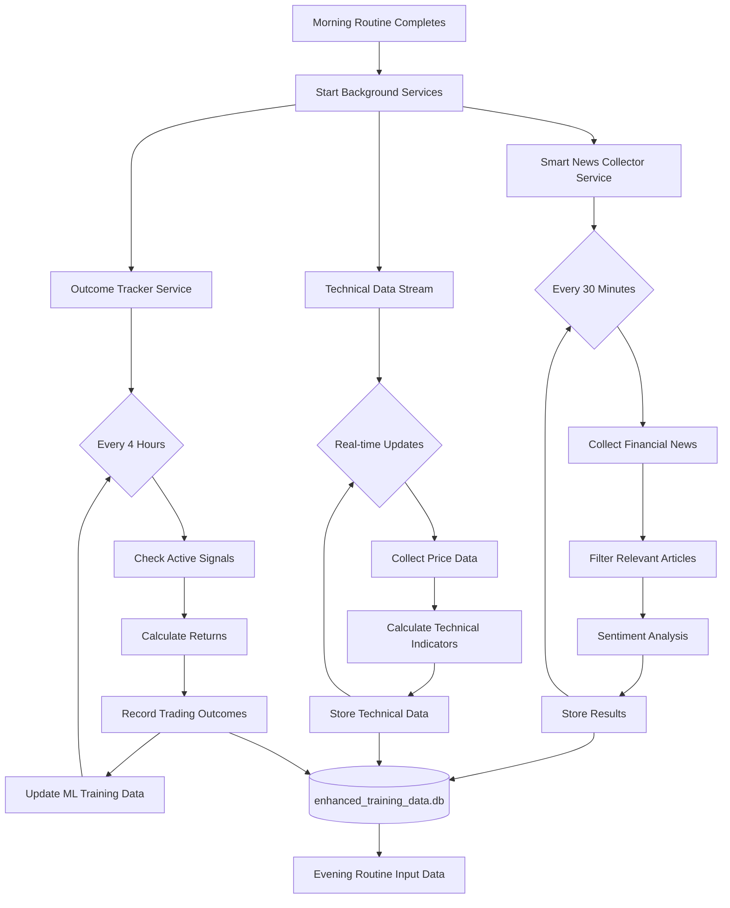
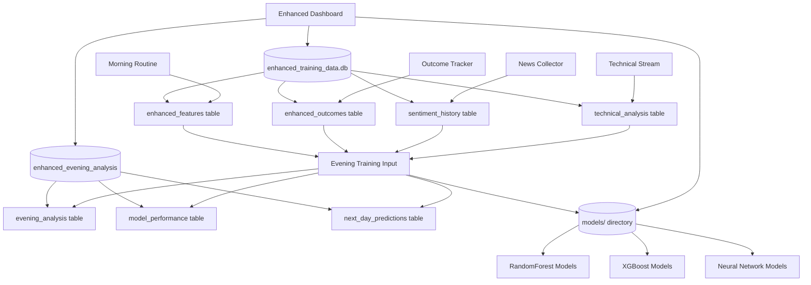

# 🔄 Complete Trading System Flow Chart

## 📊 **System Architecture Overview**

```mermaid
graph TD
    A[🚀 app.main Entry Point] --> B{Command Selection}
    
    %% Command Routing
    B --> C[🌅 Morning Routine]
    B --> D[🌆 Evening Routine]
    B --> E[📊 Dashboard]
    B --> F[📈 Status Check]
    B --> G[📰 News Analysis]
    B --> H[🔧 Other Commands]
    
    %% Morning Routine Flow
    C --> C1[TradingSystemManager]
    C1 --> C2[Enhanced Morning Analyzer]
    C2 --> C3[System Initialization]
    C3 --> C4[Data Collection Phase]
    C4 --> C5[ML Prediction Phase]
    C5 --> C6[Signal Generation]
    C6 --> C7[Start Background Services]
    
    %% Evening Routine Flow
    D --> D1[TradingSystemManager]
    D1 --> D2[Enhanced Evening Analyzer]
    D2 --> D3[Data Validation]
    D3 --> D4[Model Training]
    D4 --> D5[Performance Analysis]
    D5 --> D6[Next-Day Predictions]
    
    %% Background Services
    C7 --> BG1[Smart News Collector]
    C7 --> BG2[Technical Data Stream]
    C7 --> BG3[Outcome Tracker]
    
    %% Data Storage
    C6 --> DB[(🗄️ SQLite Databases)]
    D6 --> DB
    BG1 --> DB
    BG2 --> DB
    BG3 --> DB
    
    %% Dashboard Access
    E --> DASH[Enhanced Dashboard]
    DASH --> DB
```

---

## 🌅 **Morning Routine Detailed Flow**

```mermaid
graph TD
    START[🌅 python -m app.main morning] --> INIT[Initialize TradingSystemManager]
    
    INIT --> EMA[Create Enhanced Morning Analyzer]
    EMA --> SYSCHECK[System Health Check]
    
    SYSCHECK --> PHASE1[📊 Phase 1: Data Integration]
    
    %% Phase 1: Data Collection for Each Bank
    PHASE1 --> BANKS{For Each Bank Symbol}
    BANKS --> SENT[Get Sentiment Analysis]
    SENT --> VALID1[Validate Sentiment Data]
    VALID1 --> MARKET[Get Market Data]
    MARKET --> TECH[Technical Analysis]
    TECH --> VALID2[Validate Technical Data]
    
    %% Phase 2: ML Processing
    VALID2 --> PHASE2[🧠 Phase 2: ML Prediction]
    PHASE2 --> COLLECT[Collect Training Features]
    COLLECT --> PREDICT[Generate ML Prediction]
    PREDICT --> FEATURES[Feature Engineering]
    FEATURES --> QUALITY[Calculate Data Quality Score]
    
    %% Loop Back or Continue
    QUALITY --> BANKS
    QUALITY --> PHASE3[🎯 Phase 3: Signal Generation]
    
    %% Phase 3: Analysis and Recommendations
    PHASE3 --> SENTIMENT[Calculate Overall Sentiment]
    SENTIMENT --> RECS[Generate Recommendations]
    RECS --> COMPARE[ML vs Traditional Comparison]
    COMPARE --> PERF[Model Performance Summary]
    
    %% Phase 4: Output and Services
    PERF --> SAVE[Save Analysis Results]
    SAVE --> DISPLAY[Display Summary]
    DISPLAY --> SERVICES[Start Background Services]
    
    %% Background Services
    SERVICES --> NEWS[Smart News Collector]
    SERVICES --> STREAM[Technical Data Stream]
    SERVICES --> OUTCOME[Outcome Tracker]
    
    %% Continuous Operation
    NEWS --> NEWSLOOP[Every 30 min: News Collection]
    STREAM --> STREAMLOOP[Real-time: Price Updates]
    OUTCOME --> OUTCOMELOOP[Every 4 hours: Record Outcomes]
    
    %% Data Storage
    SAVE --> MAINDB[(enhanced_training_data.db)]
    NEWSLOOP --> MAINDB
    STREAMLOOP --> MAINDB
    OUTCOMELOOP --> MAINDB
```

---

## 🌆 **Evening Routine Detailed Flow**

```mermaid
graph TD
    START[🌆 python -m app.main evening] --> INIT[Initialize TradingSystemManager]
    
    INIT --> EEA[Create Enhanced Evening Analyzer]
    EEA --> MEMCHECK[Memory Check]
    
    MEMCHECK --> STAGE{Available Memory}
    STAGE -->|> 1.5GB| STAGE2[Load Stage 2: FinBERT + Advanced]
    STAGE -->|< 1.5GB| STAGE1[Use Stage 1: Basic ML Only]
    
    %% Phase 1: Data Collection & Validation
    STAGE2 --> PHASE1[📊 Phase 1: Data Collection & Validation]
    STAGE1 --> PHASE1
    
    PHASE1 --> COLLECT[Collect All Day's Data]
    COLLECT --> VALIDATE[Validate Data Quality]
    VALIDATE --> CLEAN[Clean & Prepare Data]
    CLEAN --> STATS[Generate Collection Stats]
    
    %% Phase 2: Model Training
    STATS --> PHASE2[🧠 Phase 2: Enhanced ML Training]
    PHASE2 --> LOAD[Load Training Dataset]
    LOAD --> FEATURES[Prepare Feature Matrix]
    FEATURES --> MODELS{Train Multiple Models}
    
    MODELS --> RF[Random Forest]
    MODELS --> XGB[XGBoost]
    MODELS --> NN[Neural Network]
    
    RF --> ENSEMBLE[Ensemble Combination]
    XGB --> ENSEMBLE
    NN --> ENSEMBLE
    
    ENSEMBLE --> VALIDATE_MODEL[Cross-Validation]
    VALIDATE_MODEL --> SAVE_MODELS[Save Trained Models]
    
    %% Phase 3: Backtesting
    SAVE_MODELS --> PHASE3[📈 Phase 3: Comprehensive Backtesting]
    PHASE3 --> HISTORICAL[Load Historical Data]
    HISTORICAL --> BACKTEST[Run Backtest Simulation]
    BACKTEST --> METRICS[Calculate Performance Metrics]
    METRICS --> RISK[Risk Assessment]
    
    %% Phase 4: Performance Validation
    RISK --> PHASE4[🎯 Phase 4: Performance Validation]
    PHASE4 --> ACCURACY[Prediction Accuracy Analysis]
    ACCURACY --> BENCHMARK[Benchmark Comparison]
    BENCHMARK --> SHARPE[Calculate Sharpe Ratio]
    SHARPE --> DRAWDOWN[Max Drawdown Analysis]
    
    %% Phase 5: Next-Day Predictions
    DRAWDOWN --> PHASE5[🔮 Phase 5: Next-Day Predictions]
    PHASE5 --> PREDICT{For Each Bank}
    PREDICT --> SENTIMENT_PRED[Get Latest Sentiment]
    SENTIMENT_PRED --> ML_PRED[Generate ML Prediction]
    ML_PRED --> CONFIDENCE[Calculate Confidence]
    CONFIDENCE --> PREDICT
    
    ML_PRED --> OUTLOOK[Market Outlook]
    OUTLOOK --> ACTIONS[Action Distribution]
    ACTIONS --> FINAL[Final Summary]
    
    %% Data Storage & Output
    FINAL --> SAVE_RESULTS[Save Evening Results]
    SAVE_RESULTS --> UPDATE_HISTORY[Update Performance History]
    UPDATE_HISTORY --> DISPLAY_SUMMARY[Display Comprehensive Summary]
    
    %% Database Updates
    SAVE_RESULTS --> EVENINGDB[(enhanced_evening_analysis)]
    UPDATE_HISTORY --> PERFDB[(ml_performance)]
    SAVE_MODELS --> MODELDB[(models/)]
```

---

## 🔄 **Continuous Background Services Flow**

---

## 🗄️ **Database Architecture Flow**

---

## 🎯 **Complete Data Lifecycle**

```mermaid
graph TD
    %% Data Generation
    START[System Start] --> MORNING[Morning Routine]
    MORNING --> FEATURES_GEN[Generate 54+ Features per Bank]
    FEATURES_GEN --> PREDICTIONS_GEN[Generate ML Predictions]
    PREDICTIONS_GEN --> SIGNALS[Trading Signals]
    
    %% Continuous Collection
    SIGNALS --> BACKGROUND[Background Services Start]
    BACKGROUND --> NEWS_CYCLE[30-min News Collection]
    BACKGROUND --> TECH_CYCLE[Real-time Technical Data]
    BACKGROUND --> OUTCOME_CYCLE[4-hour Outcome Recording]
    
    %% Data Accumulation
    NEWS_CYCLE --> DATA_GROWTH[Data Accumulation]
    TECH_CYCLE --> DATA_GROWTH
    OUTCOME_CYCLE --> DATA_GROWTH
    
    %% Evening Processing
    DATA_GROWTH --> EVENING[Evening Routine]
    EVENING --> MODEL_TRAINING[ML Model Training]
    MODEL_TRAINING --> PERFORMANCE[Performance Analysis]
    PERFORMANCE --> NEXT_DAY[Next-Day Predictions]
    
    %% Cycle Completion
    NEXT_DAY --> DAILY_COMPLETE[Daily Cycle Complete]
    DAILY_COMPLETE --> MORNING
    
    %% Key Metrics
    FEATURES_GEN -.-> METRIC1[117 Features Collected]
    PREDICTIONS_GEN -.-> METRIC2[7 Banks Analyzed]
    OUTCOME_CYCLE -.-> METRIC3[0 → 50+ Outcomes in 1-2 weeks]
    MODEL_TRAINING -.-> METRIC4[3 Model Types Trained]
    PERFORMANCE -.-> METRIC5[Accuracy & Risk Metrics]
```

---

## 🎯 **Key System Components**

### **Entry Points**
- **`app.main`**: Main command dispatcher
- **`TradingSystemManager`**: Orchestrates daily routines
- **Enhanced Analyzers**: Morning & Evening ML processors

### **Core Analysis Engines**
- **`EnhancedMorningAnalyzer`**: Real-time analysis & prediction
- **`EnhancedEveningAnalyzer`**: Training & optimization
- **`EnhancedMLTrainingPipeline`**: Feature engineering & ML training

### **Data Collection Services**
- **`SmartNewsCollector`**: Continuous news monitoring
- **`TechnicalAnalyzer`**: Market data & indicators
- **`OutcomeTracker`**: Trading result validation

### **Background Processes**
- **News Collection**: Every 30 minutes
- **Technical Streaming**: Real-time updates
- **Outcome Recording**: Every 4 hours

### **Data Storage**
- **Main DB**: `enhanced_training_data.db` (features, outcomes, sentiment)
- **Evening DB**: `enhanced_evening_analysis.db` (training results)
- **Model Storage**: `models/` directory (trained ML models)

### **Output Interfaces**
- **Dashboard**: Real-time visualization
- **Logs**: Detailed operation tracking
- **Reports**: Daily performance summaries
- **API**: Real-time data access

---

## ⚡ **Performance Characteristics**

### **Morning Routine (3-5 minutes)**
- 7 banks analyzed
- 54+ features per bank
- ML predictions generated
- Background services started

### **Evening Routine (8-12 minutes)**
- Full day data validation
- 3 ML models trained
- Comprehensive backtesting
- Next-day predictions

### **Continuous Operation**
- News: Every 30 minutes
- Technical: Real-time
- Outcomes: Every 4 hours
- Training data growth: ~10-20 samples/day

### **Data Growth Timeline**
- **Day 1**: 117 features, 0 outcomes
- **Week 1**: 50+ outcomes (training ready)
- **Week 2**: 100+ outcomes (reliable models)
- **Month 1**: 500+ outcomes (optimized performance)

This flow chart represents your complete trading system architecture from entry point through continuous operation to data storage and dashboard visualization.
