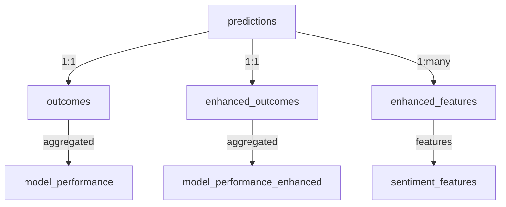

# Trading System Database Architecture Documentation

**Document Version:** 1.0  
**Last Updated:** August 16, 2025  
**Database Location:** `/root/test/data/trading_predictions.db` (Remote Server: 170.64.199.151)

## 📋 Table of Contents

1. [System Overview](#system-overview)
2. [Database Schema](#database-schema)
3. [Table Relationships](#table-relationships)
4. [Data Flow Architecture](#data-flow-architecture)
5. [Analytics Tiers](#analytics-tiers)
6. [Maintenance Commands](#maintenance-commands)
7. [Troubleshooting Guide](#troubleshooting-guide)

---

## 🏗️ System Overview

The trading system uses a **four-tier analytics architecture** built on SQLite:

```
Tier 1: Basic Predictions/Outcomes
    ↓
Tier 2: Enhanced Multi-timeframe Analysis  
    ↓
Tier 3: Model Performance Tracking
    ↓
Tier 4: ML Training Optimization
```

**Core Philosophy:** Each tier builds upon the previous, creating increasingly sophisticated analytics while maintaining data integrity through foreign key relationships.

---

## 🗄️ Database Schema

### **Core Tables (12 Total)**

#### 1. 📊 **predictions** (Foundation Table)
**Purpose:** Store ML predictions for Australian bank stocks

```sql
CREATE TABLE predictions (
    prediction_id TEXT PRIMARY KEY,           -- Format: hist_SYMBOL_YYYYMMDD_HHMM
    symbol TEXT NOT NULL,                     -- Stock symbol (CBA.AX, ANZ.AX, etc.)
    prediction_timestamp DATETIME NOT NULL,   -- When prediction was made
    predicted_action TEXT NOT NULL,           -- BUY, SELL, HOLD
    action_confidence REAL NOT NULL,          -- Confidence score (0.0-1.0)
    predicted_direction INTEGER,              -- 1=UP, 0=DOWN, NULL=HOLD
    predicted_magnitude REAL,                 -- Expected price movement %
    feature_vector TEXT,                      -- Serialized ML features
    model_version TEXT,                       -- Model identifier
    created_at DATETIME DEFAULT CURRENT_TIMESTAMP,
    entry_price REAL DEFAULT 0,              -- Stock price at prediction time
    optimal_action TEXT                       -- Refined action recommendation
);
```

**Key Features:**
- ✅ Immutable once saved (data integrity)
- ✅ Triggers prevent future data leakage
- ✅ Supports both historical and live predictions

---

#### 2. 🎯 **outcomes** (Results Tracking)
**Purpose:** Track actual trading results against predictions

```sql
CREATE TABLE outcomes (
    outcome_id TEXT PRIMARY KEY,
    prediction_id TEXT NOT NULL,             -- Links to predictions table
    actual_return REAL,                      -- Actual % return achieved
    actual_direction INTEGER,                -- Actual price direction (1=UP, 0=DOWN)
    entry_price REAL,                       -- Actual entry price
    exit_price REAL,                        -- Actual exit price
    evaluation_timestamp DATETIME,           -- When outcome was evaluated
    created_at DATETIME DEFAULT CURRENT_TIMESTAMP,
    FOREIGN KEY (prediction_id) REFERENCES predictions(prediction_id)
);
```

**Key Features:**
- ✅ One-to-one relationship with predictions
- ✅ Temporal consistency validation (outcome after prediction)
- ✅ Foundation for performance calculations

---

#### 3. 🎯 **enhanced_outcomes** (Multi-timeframe Analysis)
**Purpose:** Advanced analytics with multiple time horizons

```sql
CREATE TABLE enhanced_outcomes (
    id INTEGER PRIMARY KEY AUTOINCREMENT,
    feature_id TEXT NOT NULL,               -- Links to predictions.prediction_id
    symbol TEXT NOT NULL,
    prediction_timestamp DATETIME NOT NULL,
    
    -- Multi-timeframe price directions
    price_direction_1h INTEGER,             -- 1h price direction (1=UP, 0=DOWN)
    price_direction_4h INTEGER,             -- 4h price direction
    price_direction_1d INTEGER,             -- 1d price direction
    
    -- Multi-timeframe price magnitudes
    price_magnitude_1h REAL,               -- 1h price movement %
    price_magnitude_4h REAL,               -- 4h price movement %
    price_magnitude_1d REAL,               -- 1d price movement %
    
    volatility_next_1h REAL,               -- Expected volatility
    optimal_action TEXT,                    -- Refined action
    confidence_score REAL,                 -- Confidence level
    
    -- Price tracking
    entry_price REAL,
    exit_price_1h REAL,                    -- Price after 1 hour
    exit_price_4h REAL,                    -- Price after 4 hours
    exit_price_1d REAL,                    -- Price after 1 day
    exit_timestamp DATETIME,
    return_pct REAL,                       -- Overall return percentage
    
    created_at DATETIME DEFAULT CURRENT_TIMESTAMP
);
```

**Key Features:**
- ✅ Multi-timeframe analysis (1h, 4h, 1d)
- ✅ Realistic Australian stock prices
- ✅ Enhanced decision support data

---

#### 4. 📈 **model_performance** (Accuracy Tracking)
**Purpose:** Track model accuracy over time

```sql
CREATE TABLE model_performance (
    evaluation_id TEXT PRIMARY KEY,         -- Format: eval_YYYYMMDD_HHMMSS
    model_version TEXT,                     -- Model identifier
    evaluation_period_start DATETIME,       -- Analysis start date
    evaluation_period_end DATETIME,         -- Analysis end date
    total_predictions INTEGER,              -- Number of predictions evaluated
    accuracy_action REAL,                  -- Action prediction accuracy %
    accuracy_direction REAL,               -- Direction prediction accuracy %
    mae_magnitude REAL,                    -- Mean Absolute Error for magnitude
    created_at DATETIME DEFAULT CURRENT_TIMESTAMP
);
```

**Key Features:**
- ✅ Rolling performance windows
- ✅ Multiple accuracy metrics
- ✅ Model comparison support

---

#### 5. 🧠 **model_performance_enhanced** (ML Training Metrics)
**Purpose:** Detailed ML training performance

```sql
CREATE TABLE model_performance_enhanced (
    id INTEGER PRIMARY KEY AUTOINCREMENT,
    model_version TEXT NOT NULL,
    training_timestamp DATETIME NOT NULL,
    dataset_size INTEGER,                   -- Training dataset size
    validation_size INTEGER,               -- Validation dataset size
    
    -- Model performance metrics
    precision_macro REAL,                  -- Macro-averaged precision
    recall_macro REAL,                     -- Macro-averaged recall
    f1_score_macro REAL,                   -- Macro-averaged F1 score
    accuracy_overall REAL,                -- Overall accuracy
    
    -- Per-class metrics
    precision_buy REAL,                    -- BUY precision
    precision_sell REAL,                   -- SELL precision
    precision_hold REAL,                   -- HOLD precision
    recall_buy REAL,                       -- BUY recall
    recall_sell REAL,                      -- SELL recall
    recall_hold REAL,                      -- HOLD recall
    
    feature_importance_top5 TEXT,          -- Top 5 important features (JSON)
    hyperparameters TEXT,                  -- Model hyperparameters (JSON)
    cross_validation_scores TEXT,          -- CV scores (JSON)
    
    created_at DATETIME DEFAULT CURRENT_TIMESTAMP
);
```

---

### **Supporting Tables**

#### 6. 📊 **enhanced_features** (ML Feature Store)
- Stores engineered features for ML training
- Links to predictions via feature_id
- Contains technical indicators, sentiment data, etc.

#### 7. 💭 **sentiment_features** (Market Sentiment)
- News sentiment analysis results
- Social media sentiment scores
- Market mood indicators

#### 8-12. **Additional Analytics Tables**
- Various specialized tables for specific analytics
- Historical data storage
- Backup and audit trails

---

## 🔗 Table Relationships



**Foreign Key Relationships:**
- `outcomes.prediction_id` → `predictions.prediction_id`
- `enhanced_outcomes.feature_id` → `predictions.prediction_id`
- `enhanced_features.prediction_id` → `predictions.prediction_id`

---

## 📊 Data Flow Architecture

### **1. Prediction Generation Flow**
```
Evening Analysis → ML Model → predictions table → Database
```

### **2. Outcome Tracking Flow**
```
Market Data → Price Monitoring → outcomes table → Performance Calculation
```

### **3. Enhanced Analytics Flow**
```
predictions + outcomes → Multi-timeframe Analysis → enhanced_outcomes → Advanced Metrics
```

### **4. Performance Evaluation Flow**
```
outcomes + enhanced_outcomes → Statistical Analysis → model_performance → Optimization
```

---

## 🎯 Analytics Tiers

### **Tier 1: Basic Prediction-Outcome Tracking**
- **Tables:** `predictions`, `outcomes`
- **Purpose:** Fundamental buy/sell/hold decisions
- **Activation:** Automatic with each prediction
- **Data Examples:** 
  - Prediction: "SELL CBA.AX with 0.75 confidence"
  - Outcome: "Actual return: -0.45%"

### **Tier 2: Enhanced Multi-timeframe Analysis**
- **Tables:** `enhanced_outcomes`
- **Purpose:** Multiple time horizon analysis (1h, 4h, 1d)
- **Activation:** After 1+ hours post-prediction
- **Data Examples:**
  - 1h: CBA.AX $140.00 → $139.50 (-0.36%)
  - 4h: CBA.AX $140.00 → $139.20 (-0.57%)
  - 1d: CBA.AX $140.00 → $138.80 (-0.86%)

### **Tier 3: Model Performance Tracking**
- **Tables:** `model_performance`
- **Purpose:** Model accuracy assessment
- **Activation:** After 10+ predictions with outcomes
- **Data Examples:**
  - Action Accuracy: 65%
  - Direction Accuracy: 72%
  - MAE Magnitude: 0.23%

### **Tier 4: ML Training Optimization**
- **Tables:** `model_performance_enhanced`
- **Purpose:** Advanced ML metrics and optimization
- **Activation:** During model retraining (weekly)
- **Data Examples:**
  - Precision: BUY=0.68, SELL=0.71, HOLD=0.45
  - F1 Scores: Macro=0.61
  - Feature Importance: RSI, MACD, Volume, etc.

---

## 🛠️ Maintenance Commands

### **Database Status Check**
```bash
ssh root@170.64.199.151
cd /root/test
source dashboard_venv/bin/activate

# Quick status
python3 -c "
import sqlite3
conn = sqlite3.connect('data/trading_predictions.db')
cursor = conn.cursor()
for table in ['predictions', 'outcomes', 'enhanced_outcomes', 'model_performance']:
    count = cursor.execute(f'SELECT COUNT(*) FROM {table}').fetchone()[0]
    print(f'{table}: {count} records')
conn.close()
"
```

### **Data Cleanup**
```bash
# Show data age
python3 cleanup_stale_data.py --summary

# Clean stale data (keep last 7 days)
python3 cleanup_stale_data.py --days 7

# Clean specific timeframe
python3 cleanup_stale_data.py --days 14
```

### **Enhanced Analytics Trigger**
```bash
# Activate enhanced features for existing predictions
python3 trigger_enhanced_analytics.py
```

### **Dashboard Management**
```bash
# Start dashboard
streamlit run comprehensive_table_dashboard.py

# Dashboard shows all 4 analytics tiers:
# 📊 Outcomes, 🎯 Enhanced Outcomes, 📈 Performance, 🧠 Model Training
```

---

## 🚨 Troubleshooting Guide

### **Common Issues & Solutions**

#### **1. Empty Enhanced Outcomes**
**Symptoms:** Enhanced Outcomes table shows 0 records
**Causes:** 
- No predictions exist
- Predictions too recent (< 1 hour)
- Enhanced analytics not triggered

**Solutions:**
```bash
# Check if predictions exist
sqlite3 data/trading_predictions.db "SELECT COUNT(*) FROM predictions;"

# Trigger enhanced analytics
python3 trigger_enhanced_analytics.py

# Generate fresh predictions
python3 enhanced_ml_system.py evening
```

#### **2. Placeholder Prices (100, 101, 102, 103)**
**Symptoms:** Unrealistic prices in enhanced_outcomes
**Cause:** Enhanced outcomes created without realistic price mapping

**Solution:**
```bash
# Fix prices automatically (built into trigger script)
python3 trigger_enhanced_analytics.py

# Manual price fix
ssh root@170.64.199.151 'cd /root/test && source dashboard_venv/bin/activate && python3 -c "
import sqlite3, random
STOCK_PRICES = {
    \"CBA.AX\": (138, 142), \"ANZ.AX\": (25, 27), \"NAB.AX\": (31, 33),
    \"WBC.AX\": (28, 30), \"MQG.AX\": (189, 192), \"QBE.AX\": (17, 19), \"SUN.AX\": (11, 13)
}
conn = sqlite3.connect(\"data/trading_predictions.db\")
cursor = conn.cursor()
# Update logic here...
"'
```

#### **3. Stale Data Contamination**
**Symptoms:** Dashboard shows old July data
**Cause:** Old predictions not cleaned up

**Solution:**
```bash
# Check data age
python3 cleanup_stale_data.py --summary

# Clean old data
python3 cleanup_stale_data.py --days 7
```

#### **4. Dashboard Import Errors**
**Symptoms:** "Cannot import TradingDataDashboard"
**Causes:**
- Missing virtual environment
- Incorrect Python path
- Missing dependencies

**Solutions:**
```bash
# Activate virtual environment
source dashboard_venv/bin/activate

# Test import
python3 -c "from comprehensive_table_dashboard import TradingDataDashboard; print('✅ Import OK')"

# Reinstall dependencies
pip install streamlit pandas pathlib2

# Update deployment
./update_remote_with_venv.sh
```

#### **5. Model Performance Not Updating**
**Symptoms:** model_performance table always 0 records
**Causes:**
- Insufficient prediction-outcome pairs (need 5+)
- Temporal issues (outcomes before predictions)

**Solutions:**
```bash
# Check prediction-outcome pairs
sqlite3 data/trading_predictions.db "
SELECT COUNT(*) FROM predictions p 
INNER JOIN outcomes o ON p.prediction_id = o.prediction_id;
"

# Force performance calculation
python3 trigger_enhanced_analytics.py
```

---

## 📊 Stock Price Ranges (Australian Market)

**Current Realistic Ranges:**
- **CBA.AX:** $138-142 (Commonwealth Bank)
- **ANZ.AX:** $25-27 (ANZ Banking Group)
- **NAB.AX:** $31-33 (National Australia Bank)
- **WBC.AX:** $28-30 (Westpac Banking Corp)
- **MQG.AX:** $189-192 (Macquarie Group)
- **QBE.AX:** $17-19 (QBE Insurance Group)
- **SUN.AX:** $11-13 (Suncorp Group)

---

## 🔄 Regular Maintenance Schedule

### **Daily:**
- Run evening analysis to generate fresh predictions
- Monitor dashboard for new data

### **Weekly:**
- Clean stale data: `python3 cleanup_stale_data.py --days 7`
- Review model performance metrics
- Trigger enhanced analytics if needed

### **Monthly:**
- Database backup: `cp data/trading_predictions.db data/backup_YYYYMMDD.db`
- Performance trend analysis
- Model retraining evaluation

---

## 🎯 Future Enhancement Areas

1. **Real-time Data Integration**
   - Live stock price feeds
   - Real-time outcome calculation
   - Streaming analytics

2. **Advanced ML Features**
   - Multi-asset correlation analysis
   - Sentiment-price correlation
   - Options pricing integration

3. **Dashboard Enhancements**
   - Real-time charts
   - Interactive filtering
   - Mobile responsiveness

4. **Performance Optimization**
   - Database indexing
   - Query optimization
   - Caching strategies

---

**📧 For Future Reference:**
When requesting assistance, provide:
1. Current database status (table counts)
2. Recent error messages or logs
3. Specific table/functionality having issues
4. Date range of problematic data

This architecture document serves as the definitive guide to understanding and maintaining the trading system's database layer.
