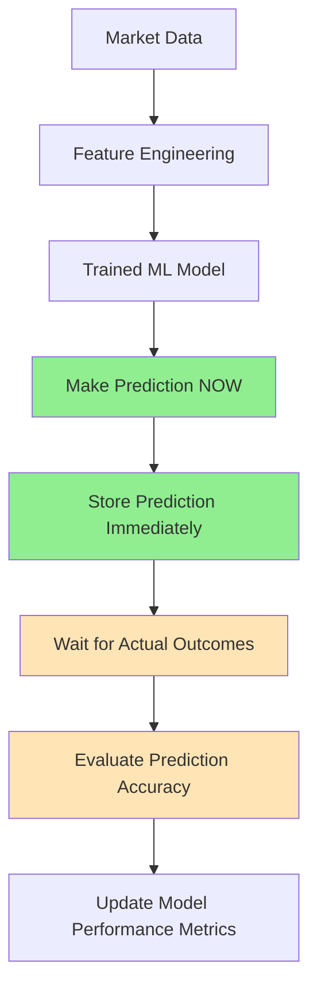

# 🏗️ Corrected Trading Prediction Pipeline Design
*Fixing the Retrospective Labeling Architecture*

## 🚨 **Deep Dive: The Architectural Problem**

### **What Your Current System Does (WRONG)**

```mermaid
graph TD
    A[Market Data] --> B[Feature Engineering]
    B --> C[Wait for Price Movement]
    C --> D[Calculate Actual Returns]
    D --> E{Return Analysis}
    E -->|>0.5%| F[Label as BUY]
    E -->|<-0.5%| G[Label as SELL]
    E -->|Other| H[Label as HOLD]
    F --> I[Store as "Prediction"]
    G --> I
    H --> I
```

**This is fundamentally broken because:**

1. **No Forward-Looking Intelligence**: The system waits to see what happens, then creates labels
2. **Data Leakage**: Future information (actual returns) determines past "predictions"
3. **Temporal Inconsistency**: Some labels created immediately, others days later
4. **Curve Fitting**: System is memorizing outcomes, not learning patterns
5. **Impossible to Trade**: No real predictions to act on

### **The Code That Proves It**

From your `enhanced_evening_analyzer_with_ml.py`:

```python
# WRONG: This is retrospective labeling, not prediction
def _calculate_actual_outcomes(self, entry_price: float, future_data: pd.DataFrame):
    # Wait for actual price movements to occur
    magnitude_1d = ((price_1d - entry_price) / entry_price) * 100
    
    # Then assign labels based on what actually happened
    if magnitude_1d > 0.5:
        optimal_action = 'BUY'    # ← This is curve-fitting!
    elif magnitude_1d < -0.5:
        optimal_action = 'SELL'   # ← This is curve-fitting!
    else:
        optimal_action = 'HOLD'   # ← This is curve-fitting!
```

**Why This Creates Contradictions:**
- System sees price went up 0.6% initially → Labels as BUY
- But price then reverses and ends down -3.3% → Final return is negative
- Result: BUY signal with negative return (contradiction!)

---

## 🎯 **Correct Architecture Design**

### **What a Real Prediction System Should Do**



---

## 🏗️ **Detailed Pipeline Implementation**

### **Phase 1: Real-Time Prediction Engine**

```python
class TruePredictionEngine:
    def __init__(self):
        self.model = self._load_trained_model()
        self.prediction_store = PredictionStore()
        
    def make_prediction(self, symbol: str, features: Dict) -> Dict:
        """Make a real prediction at feature creation time"""
        
        # 1. IMMEDIATE PREDICTION (no waiting!)
        prediction_timestamp = datetime.now()
        
        # 2. Use trained model to predict
        feature_vector = self._prepare_features(features)
        
        # Action prediction
        action_proba = self.model.predict_proba(feature_vector)[0]
        predicted_action = self.model.predict(feature_vector)[0]
        confidence = max(action_proba)
        
        # Price direction prediction (separate model)
        direction_proba = self.direction_model.predict_proba(feature_vector)[0]
        predicted_direction = self.direction_model.predict(feature_vector)[0]
        
        # Price magnitude prediction (regression)
        predicted_magnitude = self.magnitude_model.predict(feature_vector)[0]
        
        prediction = {
            'prediction_id': str(uuid.uuid4()),
            'symbol': symbol,
            'prediction_timestamp': prediction_timestamp,
            'predicted_action': predicted_action,
            'action_confidence': confidence,
            'predicted_direction': predicted_direction,  # 1=UP, -1=DOWN
            'predicted_magnitude': predicted_magnitude,  # Expected % change
            'feature_vector': feature_vector.tolist(),
            'model_version': self.model_version
        }
        
        # 3. STORE IMMEDIATELY (never change this!)
        self.prediction_store.save_prediction(prediction)
        
        return prediction
```

### **Phase 2: Outcome Evaluation Pipeline (Separate!)**

```python
class OutcomeEvaluator:
    def __init__(self):
        self.prediction_store = PredictionStore()
        
    def evaluate_predictions(self):
        """Evaluate predictions after outcomes are known"""
        
        # Get predictions without outcomes
        pending_predictions = self.prediction_store.get_pending_evaluations()
        
        for prediction in pending_predictions:
            # Wait appropriate time for outcome
            if self._is_evaluation_ready(prediction):
                outcome = self._calculate_actual_outcome(prediction)
                self._store_evaluation(prediction['prediction_id'], outcome)
    
    def _calculate_actual_outcome(self, prediction: Dict) -> Dict:
        """Calculate what actually happened (separate from prediction)"""
        
        symbol = prediction['symbol']
        pred_time = prediction['prediction_timestamp']
        
        # Get market data AFTER prediction time
        market_data = get_market_data_after(symbol, pred_time)
        
        # Calculate actual returns
        entry_price = market_data['Close'].iloc[0]
        exit_price_1d = market_data['Close'].iloc[24]  # 24 hours later
        
        actual_return = ((exit_price_1d - entry_price) / entry_price) * 100
        actual_direction = 1 if actual_return > 0 else -1
        
        return {
            'prediction_id': prediction['prediction_id'],
            'actual_return': actual_return,
            'actual_direction': actual_direction,
            'entry_price': entry_price,
            'exit_price': exit_price_1d,
            'evaluation_timestamp': datetime.now()
        }
```

### **Phase 3: Model Training Pipeline**

```python
class ModelTrainer:
    def __init__(self):
        self.prediction_store = PredictionStore()
        
    def train_models(self, training_period_days: int = 30):
        """Train models on historical data with proper temporal splits"""
        
        # Get historical data with TEMPORAL split (critical!)
        cutoff_date = datetime.now() - timedelta(days=7)  # Never train on recent data
        
        # Training data: features + actual outcomes (only historical)
        training_data = self.prediction_store.get_training_data(
            start_date=datetime.now() - timedelta(days=training_period_days),
            end_date=cutoff_date
        )
        
        # Prepare features and targets
        X = np.array([d['feature_vector'] for d in training_data])
        
        # Action classification targets
        y_action = [d['actual_optimal_action'] for d in training_data]
        
        # Direction classification targets  
        y_direction = [d['actual_direction'] for d in training_data]
        
        # Magnitude regression targets
        y_magnitude = [d['actual_return'] for d in training_data]
        
        # Train separate models
        self.action_model = RandomForestClassifier().fit(X, y_action)
        self.direction_model = RandomForestClassifier().fit(X, y_direction)
        self.magnitude_model = RandomForestRegressor().fit(X, y_magnitude)
        
        # Validate on holdout period
        self._validate_models(cutoff_date)
    
    def _determine_optimal_action(self, actual_return: float, confidence: float) -> str:
        """Determine what the optimal action SHOULD have been"""
        # This is only for training labels, never for live predictions!
        
        if actual_return > 2.0 and confidence > 0.7:
            return 'STRONG_BUY'
        elif actual_return > 0.5:
            return 'BUY'
        elif actual_return < -2.0 and confidence > 0.7:
            return 'STRONG_SELL'
        elif actual_return < -0.5:
            return 'SELL'
        else:
            return 'HOLD'
```

---

## 📊 **Database Schema for Proper Separation**

### **predictions Table** (Immutable!)
```sql
CREATE TABLE predictions (
    prediction_id TEXT PRIMARY KEY,
    symbol TEXT NOT NULL,
    prediction_timestamp DATETIME NOT NULL,
    predicted_action TEXT NOT NULL,
    action_confidence REAL NOT NULL,
    predicted_direction INTEGER,  -- 1=UP, -1=DOWN
    predicted_magnitude REAL,     -- Expected % change
    feature_vector TEXT,          -- JSON of features used
    model_version TEXT,
    created_at DATETIME DEFAULT CURRENT_TIMESTAMP
);
```

### **outcomes Table** (Separate!)
```sql
CREATE TABLE outcomes (
    outcome_id TEXT PRIMARY KEY,
    prediction_id TEXT NOT NULL,
    actual_return REAL,
    actual_direction INTEGER,
    entry_price REAL,
    exit_price REAL,
    evaluation_timestamp DATETIME,
    created_at DATETIME DEFAULT CURRENT_TIMESTAMP,
    FOREIGN KEY (prediction_id) REFERENCES predictions(prediction_id)
);
```

### **model_performance Table**
```sql
CREATE TABLE model_performance (
    evaluation_id TEXT PRIMARY KEY,
    model_version TEXT,
    evaluation_period_start DATETIME,
    evaluation_period_end DATETIME,
    total_predictions INTEGER,
    accuracy_action REAL,
    accuracy_direction REAL,
    mae_magnitude REAL,
    sharpe_ratio REAL,
    created_at DATETIME DEFAULT CURRENT_TIMESTAMP
);
```

---

## 🔧 **Implementation Steps**

### **Step 1: Stop Current System**
```bash
# Disable the retrospective labeling
# This prevents more corrupted "predictions"
```

### **Step 2: Clean Historical Data**
```python
def clean_historical_data():
    """Convert retrospective labels to proper training data"""
    
    # Current "predictions" become training labels
    # But we can't use them for model evaluation!
    conn = sqlite3.connect("trading_unified.db")
    
    # Migrate to proper structure
    cursor.execute("""
        INSERT INTO training_labels 
        SELECT 
            feature_id,
            symbol,
            prediction_timestamp,
            optimal_action as actual_optimal_action,
            return_pct as actual_return,
            'retrospective_label' as source
        FROM enhanced_outcomes
    """)
```

### **Step 3: Implement Real-Time Pipeline**
```python
class LiveTradingEngine:
    def __init__(self):
        self.predictor = TruePredictionEngine()
        self.evaluator = OutcomeEvaluator()
        
    def run_prediction_cycle(self):
        """Main prediction loop"""
        
        symbols = ['ANZ.AX', 'CBA.AX', 'NAB.AX', 'WBC.AX', 'MQG.AX', 'QBE.AX', 'SUN.AX']
        
        for symbol in symbols:
            # 1. Collect features
            features = self.collect_current_features(symbol)
            
            # 2. Make immediate prediction
            prediction = self.predictor.make_prediction(symbol, features)
            
            # 3. Log for trading decision
            self.log_trading_signal(prediction)
        
        # 4. Evaluate old predictions (separate process)
        self.evaluator.evaluate_predictions()
```

---

## 🎯 **Key Differences: Before vs After**

| Aspect | WRONG (Current) | CORRECT (New) |
|--------|----------------|---------------|
| **Timing** | Wait for outcomes → Label | Predict immediately → Wait for outcomes |
| **Data Flow** | Future → Past (leakage) | Past → Future (proper) |
| **Storage** | Mutable "predictions" | Immutable predictions + separate outcomes |
| **Evaluation** | Meaningless (curve-fit) | Valid (temporal split) |
| **Trading** | Impossible (no predictions) | Possible (real predictions) |
| **Learning** | Memorization | Pattern recognition |

---

## 📈 **Expected Results After Fix**

### **Immediate Impact**
- **Real predictions** you can actually trade on
- **Proper performance metrics** (likely lower but honest)
- **Temporal consistency** in decision making
- **Elimination of contradictions** (BUY/DOWN conflicts)

### **Long-term Benefits**
- **Actual machine learning** instead of curve-fitting
- **Measurable improvement** over time
- **Confidence in system** for live trading
- **Proper risk management** based on real predictions

---

## 🚨 **Critical Implementation Notes**

### **1. Never Mix Prediction and Evaluation**
```python
# WRONG
def predict_and_label(features):
    wait_for_outcome()
    return label_based_on_outcome()

# RIGHT  
def predict(features):
    return model.predict(features)  # Immediate!

def evaluate_later(prediction_id):
    return compare_prediction_to_outcome()
```

### **2. Strict Temporal Boundaries**
```python
# WRONG: Training on future data
training_data = get_data(start_date, end_date)  # Includes recent data

# RIGHT: Proper temporal split
training_cutoff = datetime.now() - timedelta(days=7)
training_data = get_data(start_date, training_cutoff)  # Never train on recent
```

### **3. Immutable Predictions**
```python
# WRONG: Changing predictions
prediction['action'] = new_action  # NEVER DO THIS!

# RIGHT: Predictions are immutable
prediction = create_prediction(features)  # Store once, never change
```

This architecture will transform your system from a retrospective labeling tool into a genuine predictive trading system. The key insight is **temporal separation** - predictions must be made before outcomes are known, never after.

Would you like me to start implementing specific components of this corrected pipeline?
